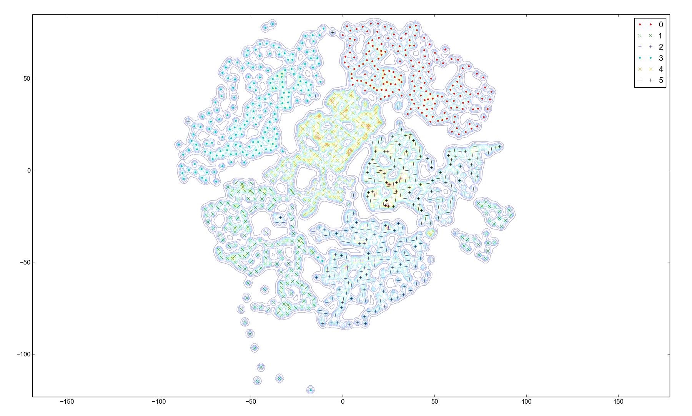
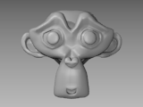
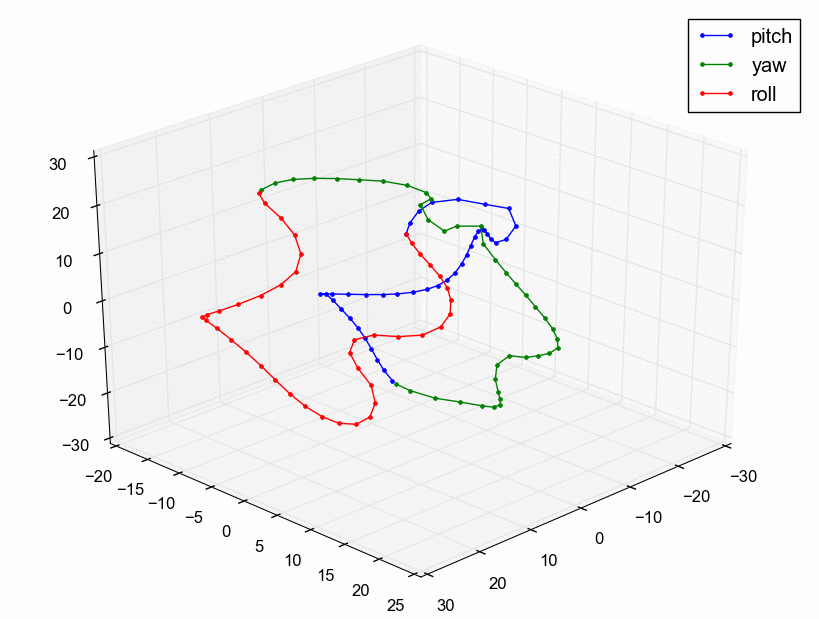

# python-ukr
Unsupervised Kernel Regression (UKR) for Python/Numpy.

The UKR contructs a mapping between a low-dimensional space `x` in `R^q` to a
high-dimensional space y in `R^d`, `d>q`, using a Nadaraya-Watson estimator:
```
                        K(x - x )        
          __ N                 i         
f(x)  =  \         ------------------- y 
         /__ i = 1  __ N                i
                   \         K(x - x )   
                   /__ j = 1        j    
```
`K()` is the kernel. Usually, `q` is 1, 2, or 3. The set of pairs `(x_i,y_i)`
form the support samples whereas the samples `x_i` are the manifold points. The
high-dimensional points `y` are given and the low-dimensional counterparts `x`
are determined by the UKR. The UKR is able to project any point on the manifold
to the high-dimensional space, but not vice-versa. Usually, the kernel needs
some kind of bandwidth parameter (sigma) but in this UKR formulation it's not
necessary because the pairwise mutual distances of the manifold points `x` has
the bandwidth included.

## Requirements
* Python 2.7
* SciPy
* Numpy
* scikit-learn
* Numexpr [optional]
* Matplotlib [for examples]

Note for Windows users: All packages are available in the WinPython (http://winpython.sourceforge.net/) distribution.

## Examples

All following examples are included in the _examples_ directory.

### Digits Manifold

UKR test with a subset of the MNIST digits data. The contour lines visualize
the density.



### Rotating Suzanne Head

Generates, interpolates and visualizes the "monkey head" manifold. The head is
the Blender mascot Suzanne rotating around each three-dimensional axis:



Puts all images in a single matrix and generates a 3D manifold from these
images:



## References

### UKR Basics
* Meinicke, P. and Klanke, S. and Memisevic, R. and Ritter, H.:  
  _Principal surfaces from unsupervised kernel regression_,  
  Pattern Analysis and Machine Intelligence (PAMI),  
  vol 27 (9): 1379-1391, 2005

* Klanke, Stefan:   
  _Learning manifolds with the Parametrized Self-Organizing Map and Unsupervised Kernel Regression_,  
  Phd Thesis, Bielefeld University, 2007

### iRProp+
* Igel, Christian and Hüsken, Michael:  
  _Improving the Rprop Learning Algorithm_,  
  Proceedings of the Second International ICSC Symposium on Neural Computation,  
  ICSC Academic Press, pp. 115-121, 2000

### Project Samples to the Manifold
* Isard, M. and Blake, A.:  
  _CONDENSATION - conditional density propagation of visual tracking_,  
  International Journal of Computer Vision, vol 29 (1): 5–28, 1998

### Possible Applications
* Hermes, C.:  
  _Aktionserkennung und -prädiktion mittels Trajektorienklassifikation_,  
  Phd Thesis, Bielefeld University, Applied Informatics, 2012
